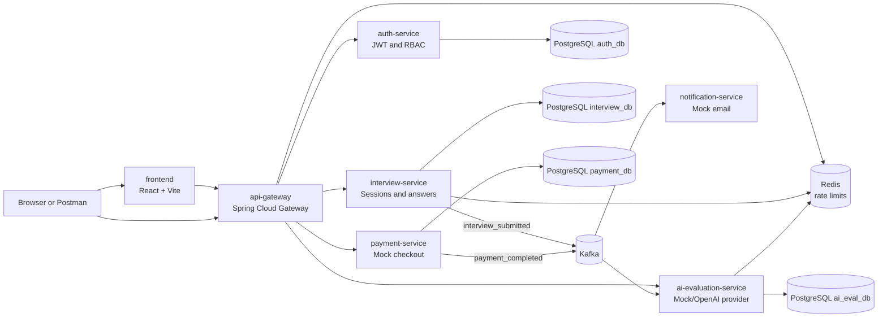

# AI Interview Platform

AI Interview Platform is a portfolio-grade full-stack microservices product for technical interview practice, AI-style answer evaluation, mock subscriptions, Kafka events, Redis caching, Docker deployment, and CI readiness.

## Architecture



## Service Responsibilities

- `frontend`: React + TypeScript product console for candidate registration, interview submission, AI result review, payment demo, and service health.
- `api-gateway`: Spring Cloud Gateway routing, global CORS, Redis-backed request rate limiting.
- `auth-service`: register/login APIs, BCrypt password hashing, JWT issuing, and `CANDIDATE`, `RECRUITER`, `ADMIN` role model.
- `interview-service`: interview sessions, candidate answers, Redis session cache, and `interview_submitted` Kafka producer.
- `ai-evaluation-service`: Kafka consumer, retry/DLQ handler, pluggable `AiProvider`, mock local evaluation, result persistence, Redis result cache.
- `payment-service`: seeded subscription plans, mock checkout abstraction, idempotent callback processing, and `payment_completed` Kafka producer.
- `notification-service`: Kafka consumers and mock email abstraction.
- `common-lib`: shared DTOs, error response models, constants, and event contracts.

## Local Setup Commands

Prerequisites: Java 21 and Docker Desktop. The Maven wrapper is included.

```powershell
cd D:\Projects\ai-interview-platform
copy .env.example .env
.\mvnw.cmd clean package
docker compose up --build
```

Open the product UI:

```text
http://localhost:3000
```

Health checks:

```powershell
curl http://localhost:3000
curl http://localhost:8080/actuator/health
curl http://localhost:8081/actuator/health
curl http://localhost:8082/actuator/health
curl http://localhost:8083/actuator/health
curl http://localhost:8084/actuator/health
curl http://localhost:8085/actuator/health
```

Swagger UI:

- Auth: http://localhost:8081/swagger-ui.html
- Interview: http://localhost:8082/swagger-ui.html
- AI Evaluation: http://localhost:8083/swagger-ui.html
- Payment: http://localhost:8084/swagger-ui.html

## API Examples

HTTP examples are in `requests/ai-interview-platform.http`.

Typical UI/API flow:

1. Register or login with `/api/auth/register` or `/api/auth/login`.
2. Create an interview with `POST /api/interviews`.
3. Submit answers with `POST /api/interviews/{id}/submit`.
4. Fetch the AI result with `GET /api/evaluations/interviews/{interviewId}`.
5. Create checkout via `POST /api/payments/checkout` and complete the mock callback with an `Idempotency-Key` header.

The React UI can run this complete flow from the `Run Full Demo` button.

## Kafka Topics

- `interview_submitted`: produced by interview-service, consumed by ai-evaluation-service and notification-service.
- `interview_submitted.DLT`: dead-letter topic for failed AI evaluation consumption.
- `payment_completed`: produced by payment-service, consumed by notification-service.
- `payment_completed.DLT`: reserved for payment notification dead-letter handling.

## Redis Usage

- Gateway rate limiting uses Spring Cloud Gateway RedisRateLimiter.
- Interview session reads use Spring Cache backed by Redis.
- AI evaluation fetches use Spring Cache backed by Redis.
- Auth service is Redis-ready for session/token metadata extensions.

## Database Schema Overview

- `auth_db.users`: UUID user identities, email, password hash, role, creation timestamp.
- `interview_db.interview_sessions`: UUID session, candidate ID, role, status, timestamps.
- `interview_db.candidate_answers`: UUID answer rows linked to interview sessions.
- `ai_eval_db.evaluation_results`: unique result per interview with correctness, clarity, depth, communication, and summary.
- `payment_db.subscription_plans`: seeded FREE, PRO, TEAM plans.
- `payment_db.payments`: checkout session and payment lifecycle.
- `payment_db.processed_payment_callbacks`: idempotency keys for callback replay protection.

## Future Improvements

- Add JWT verification filters at the gateway and service method authorization.
- Add recruiter/admin dashboards with candidate comparison and interview history.
- Replace mock providers with official OpenAI and Stripe clients behind the existing interfaces.
- Add OpenTelemetry tracing, centralized logs, and Prometheus/Grafana dashboards.
- Add Testcontainers integration tests for Kafka, Redis, and PostgreSQL.
- Introduce an outbox pattern for exactly-once event publication from database transactions.

## Resume Bullet Points

- Built a full-stack AI Interview Platform with React, TypeScript, Java 21, Spring Boot 3 microservices, PostgreSQL, Flyway, Redis, Kafka, Docker Compose, and GitHub Actions CI.
- Implemented event-driven interview evaluation using Kafka producers/consumers, retry/DLQ handling, and a pluggable AI provider abstraction with mock local execution.
- Designed secure auth with BCrypt password hashing, JWT issuance, role modeling, validation, OpenAPI docs, Actuator health checks, and centralized exception handling.
- Added payment workflow with subscription plans, mock checkout sessions, idempotent callback processing, and Kafka payment completion events.
- Delivered a recruiter-friendly product UI that demonstrates registration, interview submission, AI scoring, service health, and mock subscription checkout through the API gateway.
